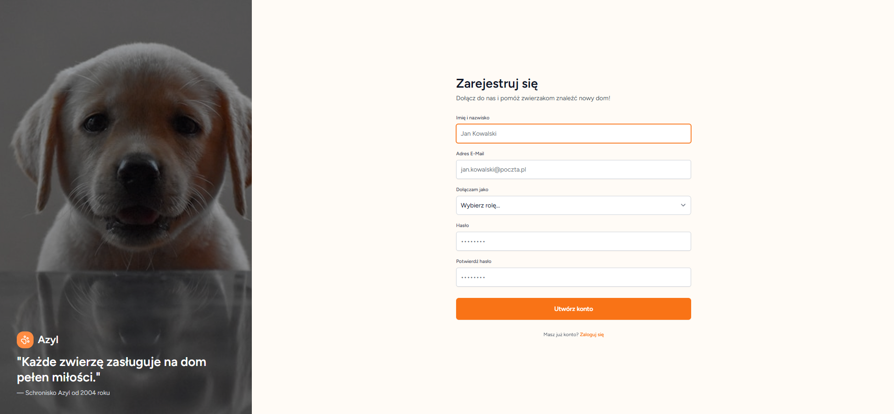
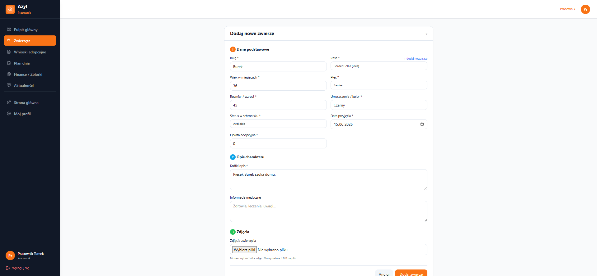
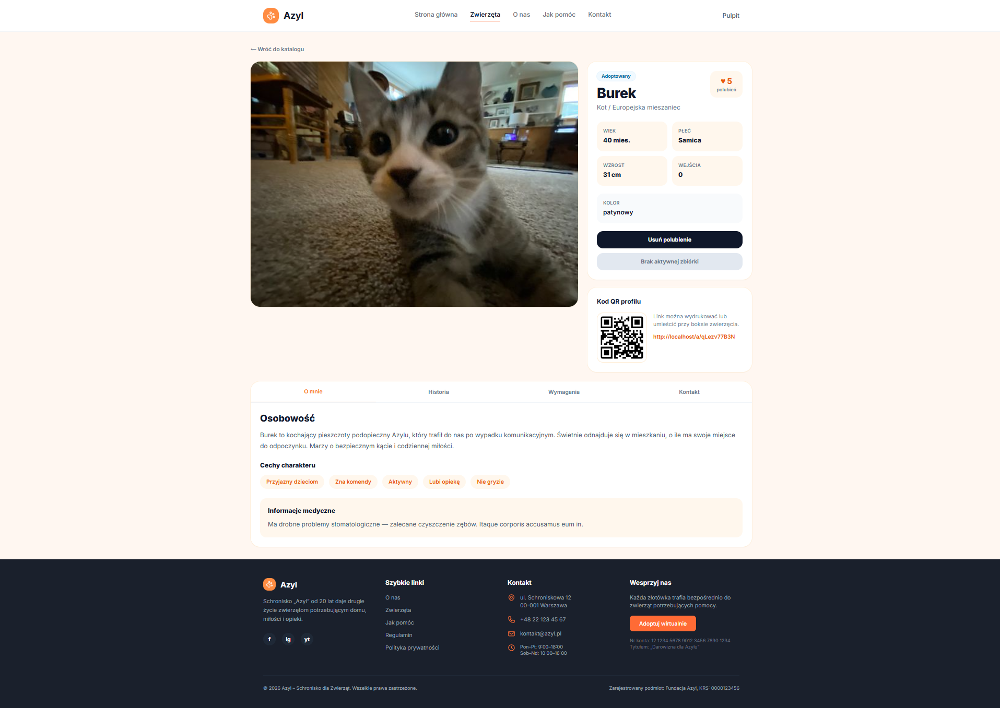
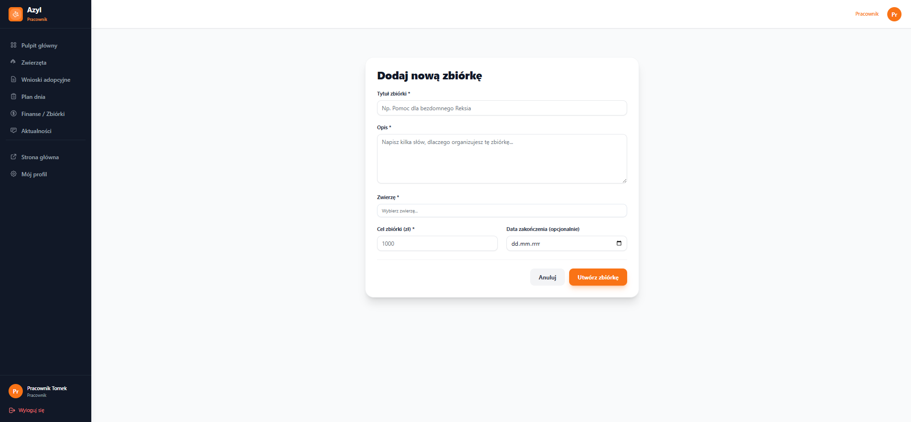
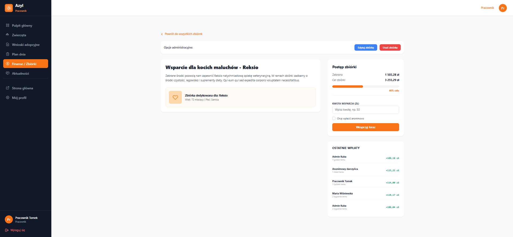
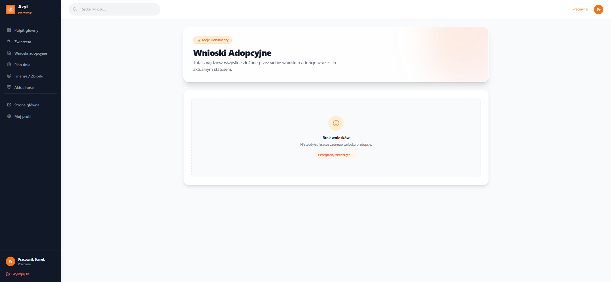
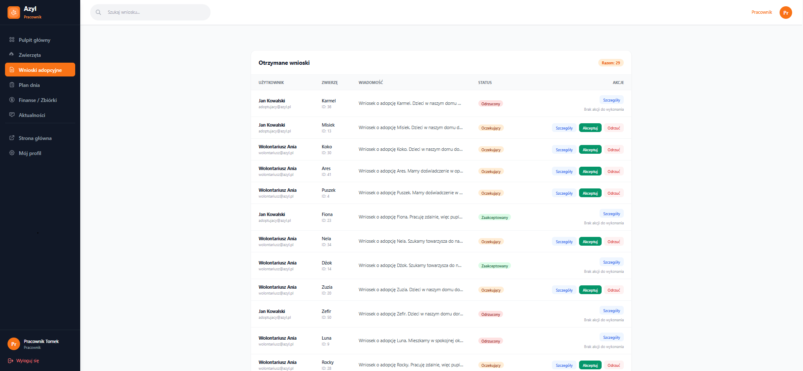
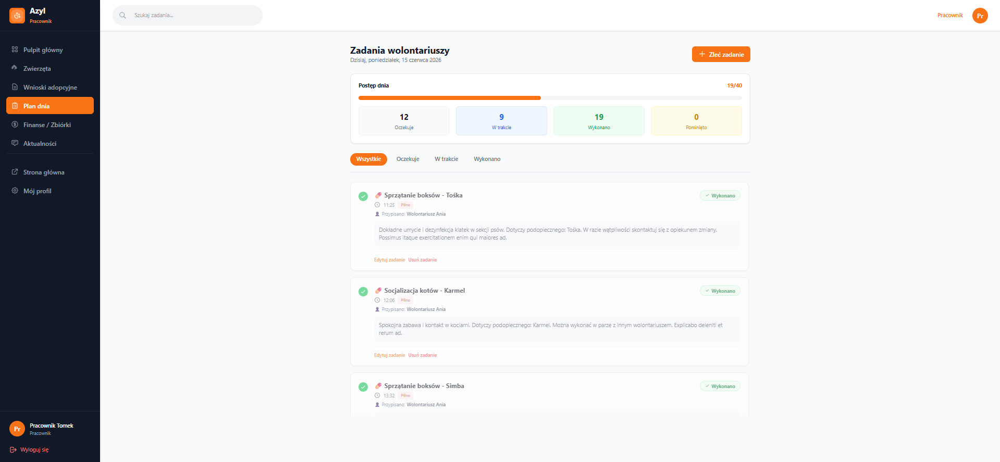

# Azyl — system zarządzania schroniskiem

Webowa aplikacja CMS/ERP dla schronisk: katalog zwierząt, adopcje, zbiórki, kartoteki medyczne i wolontariat.

---

## 1. Autorzy, podział ról

| Osoba | Zakres odpowiedzialności |
|-------|--------------------------|
| **Jakub Płocica** | Infrastruktura, auth, medyczne, wolontariat, dashboard admin |
| **Kacper Ręczak** | Adopcje, fundraising, finanse |
| **Kamil Szopniewski** | CRUD zwierząt, zdjęcia, QR, polubienia |

---

## 2. Użyte technologie

| Warstwa | Stack |
|---------|-------|
| Backend | PHP 8.5 (kontener Sail), Laravel 13, MySQL 8.4 |
| Frontend | Blade, Tailwind CSS, Alpine.js, Vite |
| Auth | Laravel Breeze, middleware ról |
| DevOps | Laravel Sail (Docker), Mailpit, phpMyAdmin |
| Biblioteki | Chart.js (dashboard), DomPDF, Laravel Sanctum, L5-Swagger |

---

## 3. Przeznaczenie aplikacji

**Azyl** cyfryzuje codzienną pracę schroniska: centralny katalog zwierząt z kodami QR, obieg wniosków adopcyjnych, zbiórki celowe i rejestr darowizn, kartoteki medyczne oraz planowanie zadań wolontariuszy. System łączy moduły operacyjne, finansowe i medyczne w jednym panelu z rozróżnieniem ról (Admin, Pracownik, Weterynarz, Wolontariusz, Adoptujący).

---

## 4. Opis funkcjonalności

- **Katalog zwierząt** — CRUD, filtry, profile publiczne, kody QR (`qr_token`), licznik odwiedzin (`animal_clicks`), polubienia.
- **Multimedia** — upload wielu zdjęć, tabela pośrednia `animal_images`, sortowanie.
- **Adopcje** — składanie wniosków, walidacja duplikatów, synchronizacja statusu zwierzęcia (dostępny → w trakcie → adoptowany).
- **Fundraising** — zbiórki przypisane do zwierząt, darowizny (także anonimowe), pasek postępu `collected_amount` / `target_amount`.
- **Medycyna** — historia leczenia, koszty, typy zabiegów (rola Weterynarz).
- **Wolontariat** — zadania z terminem, przypisanie użytkownika, status i flaga pilności.
- **Panel admina** — statystyki adopcji i gatunków (Chart.js), zarządzanie wnioskami, aktualności (`news`).
- **API** — dokumentacja Swagger (Sanctum).

---

## 5. Schemat ERD

Diagram DBML (wklej na [dbdiagram.io](https://dbdiagram.io)):

```dbml
Table roles {
  id bigint [pk, increment]
  name varchar [unique]
  description varchar [null]
  created_at timestamp
  updated_at timestamp
}

Table users {
  id bigint [pk, increment]
  name varchar
  email varchar [unique]
  email_verified_at timestamp [null]
  password varchar
  role_id bigint [ref: > roles.id]
  remember_token varchar [null]
  created_at timestamp
  updated_at timestamp
}

Table species {
  id bigint [pk, increment]
  name varchar [unique]
  created_at timestamp
  updated_at timestamp
}

Table breeds {
  id bigint [pk, increment]
  name varchar
  species_id bigint [ref: > species.id]
  created_at timestamp
  updated_at timestamp
  indexes {
    (name, species_id) [unique]
  }
}

Table animals {
  id bigint [pk, increment]
  name varchar
  breed_id bigint [ref: > breeds.id]
  caregiver_id bigint [null, ref: > users.id]
  age_months smallint
  genders smallint
  height int
  color varchar
  description text
  medical_info text [null]
  traits json [null]
  housing_conditions varchar [null]
  experience_required varchar [null]
  daily_time_required varchar [null]
  is_child_friendly boolean [default: false]
  accepts_cats boolean [default: false]
  accepts_dogs boolean [default: false]
  requires_responsible_caregiver boolean [default: false]
  contact_phone varchar [null]
  visiting_hours varchar [null]
  adoption_fee decimal(10,2) [default: 0]
  status int
  qr_token varchar [unique]
  arrival_date timestamp
  created_at timestamp
  updated_at timestamp
}

Table images {
  id bigint [pk, increment]
  animal_id bigint [ref: > animals.id]
  file_name varchar
  original_file_name varchar
  file_type varchar
  created_at timestamp
  updated_at timestamp
}

Table animal_images {
  id bigint [pk, increment]
  animal_id bigint [ref: > animals.id]
  image_id bigint [ref: > images.id]
  sort_order int [default: 0]
  created_at timestamp
  updated_at timestamp
}

Table adoption_applications {
  id bigint [pk, increment]
  user_id bigint [ref: > users.id]
  animal_id bigint [ref: > animals.id]
  status int
  message text [null]
  created_at timestamp
  updated_at timestamp
  indexes {
    (user_id, animal_id) [unique]
  }
}

Table animal_likes {
  user_id bigint [ref: > users.id]
  animal_id bigint [ref: > animals.id]
  created_at timestamp
  updated_at timestamp
  indexes {
    (user_id, animal_id) [pk]
  }
}

Table animal_clicks {
  id bigint [pk, increment]
  animal_id bigint [ref: > animals.id]
  clicked_at timestamp
}

Table fundraisers {
  id bigint [pk, increment]
  animal_id bigint [ref: > animals.id]
  title varchar
  description text
  target_amount decimal(10,2)
  collected_amount decimal(10,2) [default: 0]
  qr_token varchar [unique]
  status int
  end_date timestamp [null]
  created_at timestamp
  updated_at timestamp
}

Table donations {
  id bigint [pk, increment]
  fundraiser_id bigint [ref: > fundraisers.id]
  user_id bigint [null, ref: > users.id]
  amount decimal(8,2)
  created_at timestamp
  updated_at timestamp
}

Table medical_records {
  id bigint [pk, increment]
  animal_id bigint [ref: > animals.id]
  treatment_type varchar
  description text
  cost decimal(8,2) [default: 0]
  treatment_date timestamp
  created_at timestamp
  updated_at timestamp
}

Table volunteer_tasks {
  id bigint [pk, increment]
  title varchar
  description text [null]
  date timestamp
  time time
  status int
  is_urgent boolean [default: false]
  assigned_to bigint [null, ref: > users.id]
  created_at timestamp
  updated_at timestamp
}

Table news {
  id bigint [pk, increment]
  title varchar
  content text
  image varchar [null]
  author_id bigint [ref: > users.id]
  is_published boolean [default: false]
  published_at timestamp [null]
  created_at timestamp
  updated_at timestamp
}
```

Wizualizacja wygenerowana w projekcie:


---

## 6. Kierunki dalszego rozwoju

**Przechowywanie zdjęć (Windows)** — pliki lądują w `storage/app/public/animals`; bez `php artisan storage:link` i poprawnych uprawnień WSL/Docker obrazy z seedera (`ImageAndLikeSeeder`) nie będą widoczne. Rozważyć S3/Cloudinary zamiast lokalnego dysku na produkcji.

**Powiadomienia e-mail** — Mailpit jest w Sail, ale brak maili transakcyjnych (nowy wniosek, decyzja admina, darowizna). Kolejny krok: kolejki + szablony Mailable.

**Płatności** — darowizny są symulowane; integracja Stripe / Przelewy24 i wirtualne adopcje (subskrypcje).

**API i dokumentacja** — dokończyć konfigurację L5-Swagger i spójne endpointy REST pod Sanctum.

**Raporty medyczne** — eksport PDF (DomPDF już w zależnościach), ewentualny magazyn leków.

**Realtime** — WebSocket (Laravel Reverb) przy dużej liczbie równoległych wniosków lub zadań wolontariatu.

**Testy** — pokrycie ścieżek krytycznych: adopcja w transakcji, aktualizacja `collected_amount`, unikalność wniosków.

---

## 7. Instrukcja krok po kroku uruchomienia

### Wymagania

- [Docker Desktop](https://www.docker.com/products/docker-desktop/) (+ **WSL2** na Windows)
- Git

> Kontener aplikacji działa na **PHP 8.5** (`compose.yaml` → `docker/8.5`). Wymaganie projektu: PHP **8.4+**.

### Windows — uwagi

- Uruchamiaj komendy w terminalu WSL2 lub Git Bash; unikaj mieszania ścieżek `C:\` z `/var/www/html`.
- Nie uruchamiaj Dockera jako `root` / `sudo` — `WWWUSER` domyślnie ustawia się na `1000`.
- `ImageAndLikeSeeder` kopiuje pliki z `public/images/seed/animals/` do `storage/app/public/animals/` — upewnij się, że katalog seed istnieje w repozytorium.

### Kroki

```bash
git clone <adres_repozytorium>
cd Azyl
# opcjonalnie — kontener sam skopiuje .env.example przy pierwszym starcie:
# cp .env.example .env
docker compose up -d --build
```

Przy pierwszym uruchomieniu kontener automatycznie: tworzy `.env`, instaluje zależności (Composer + npm), buduje assety Vite, czeka na MySQL, uruchamia migracje z seederami i tworzy `storage:link`. Kolejne restarty są szybkie (pomijają setup).

**Aplikacja:** [http://localhost](http://localhost)

**Konta testowe** (hasło: `password`): `admin@azyl.pl`, `pracownik@azyl.pl`, `weterynarz@azyl.pl`, `wolontariusz@azyl.pl`, `adoptujacy@azyl.pl`

**Pomocnicze usługi Sail:** Mailpit `http://localhost:8025`, phpMyAdmin `http://localhost:8081`

---

### Kroki w aplikacji

1. **Rejestracja** — użytkownik otrzymuje rolę *Adoptujący* i dostęp do „Moje wnioski”.  
   

2. **Katalogowanie** — pracownik dodaje zwierzę, wgrywa zdjęcia; system generuje `qr_token`.  
     
   

3. **Zbiórka (opcjonalnie)** — pracownik zakłada fundraiser na leczenie zwierzęcia; użytkownicy wpłacają darowizny.  
     
   

4. **Wniosek** — adoptujący składa wniosek; unikalny constraint `(user_id, animal_id)` blokuje duplikat.  
   

5. **Decyzja admina** — akceptacja w transakcji DB zmienia status wniosku i zwierzęcia; odrzucenie przywraca dostępność, gdy nie ma innych oczekujących wniosków.  
   

6. **Wolontariat (po adopcji)** — pracownik zleca zadanie (np. przygotowanie do wydania); wolontariusz oznacza wykonanie.  
   
