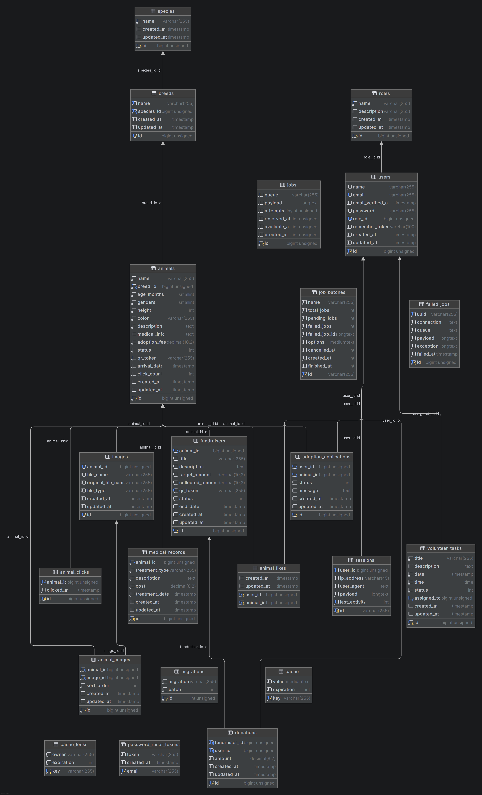
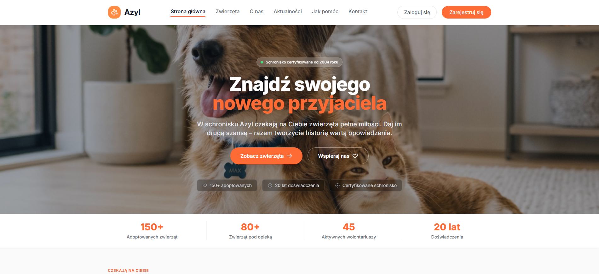
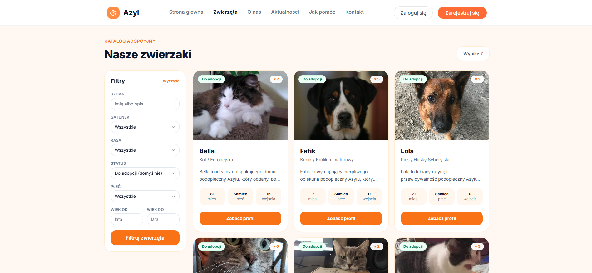
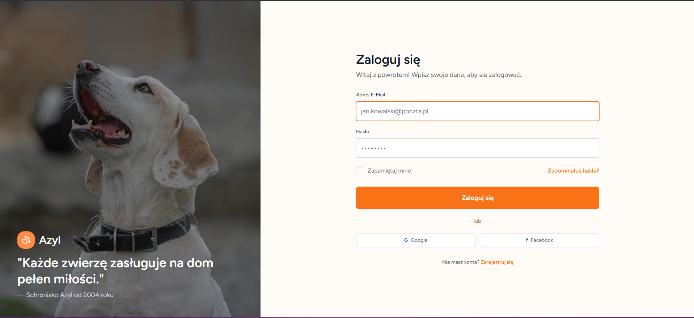
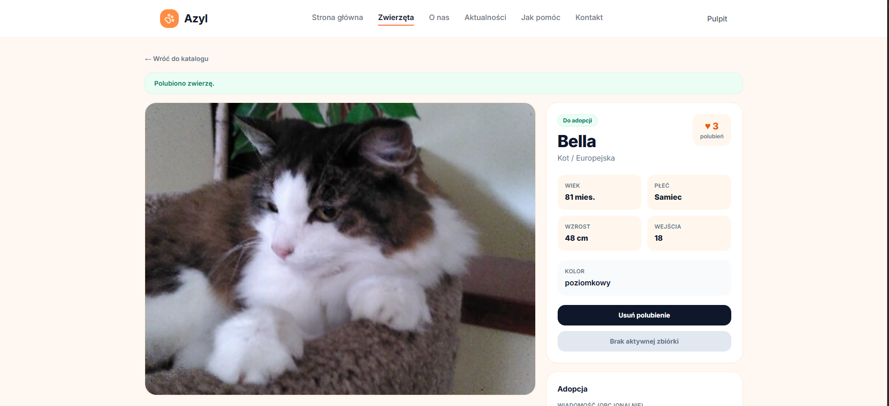
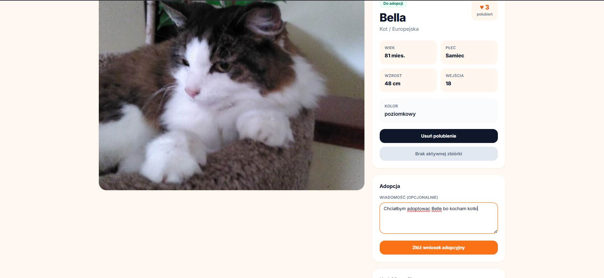

# Azyl — system zarządzania schroniskiem

Webowa aplikacja CMS/ERP dla schronisk: katalog zwierząt, adopcje, zbiórki, kartoteki medyczne i wolontariat.

---

## 1. Autorzy, podział ról

| Osoba | Zakres odpowiedzialności |
|-------|--------------------------|
| **Jakub Płocica** | Infrastruktura, auth, medyczne, wolontariat, dashboard admin |
| **Kacper Ręczak** | Adopcje, fundraising, finanse |
| **Kamil Szopniewski** | CRUD zwierząt, zdjęcia, QR, polubienia |

---

## 2. Użyte technologie

| Warstwa | Stack |
|---------|-------|
| Backend | PHP 8.5 (kontener Sail), Laravel 13, MySQL 8.4 |
| Frontend | Blade, Tailwind CSS, Alpine.js, Vite |
| Auth | Laravel Breeze, middleware ról |
| DevOps | Laravel Sail (Docker), Mailpit, phpMyAdmin |
| Biblioteki | Chart.js (dashboard), DomPDF, Laravel Sanctum, L5-Swagger |

---

## 3. Przeznaczenie aplikacji

**Azyl** cyfryzuje codzienną pracę schroniska: centralny katalog zwierząt z kodami QR, obieg wniosków adopcyjnych, zbiórki celowe i rejestr darowizn, kartoteki medyczne oraz planowanie zadań wolontariuszy. System łączy moduły operacyjne, finansowe i medyczne w jednym panelu z rozróżnieniem ról (Admin, Pracownik, Weterynarz, Wolontariusz, Adoptujący).

---

## 4. Opis funkcjonalności

Moduły pogrupowane według obszaru biznesowego; szczegółowy przepływ krok po kroku — w sekcji 8.

| Obszar | Zakres | Role |
|--------|--------|------|
| Strona publiczna | Strona główna, katalog, zbiórki, aktualności, wejście QR | Gość |
| Adopcje | Wnioski, polubienia, darowizny | Adoptujący |
| Operacje | CRUD zwierząt, wnioski, zbiórki, aktualności | Pracownik, Admin |
| Medycyna | Kartoteki, eksport PDF | Weterynarz, Admin |
| Wolontariat | Plan dnia, panel zwierząt (odczyt) | Wolontariusz, Pracownik |
| Administracja | Użytkownicy, słowniki gatunków/ras, dashboard | Admin |
| Integracje | REST API read-only, Swagger UI | Zewnętrzne systemy |

- **Katalog zwierząt** — CRUD (`Admin\AnimalController`), filtry, profile publiczne (`AnimalCatalogController`), kody QR (`qr_token`), licznik odwiedzin (`animal_clicks`), polubienia (`AnimalLikeController`).
- **Multimedia** — upload wielu zdjęć, tabela pośrednia `animal_images`, sortowanie.
- **Adopcje** — składanie wniosków (`AdoptionApplicationController`), walidacja duplikatów `(user_id, animal_id)`, synchronizacja statusu zwierzęcia (dostępny → w trakcie → adoptowany).
- **Fundraising** — zbiórki przypisane do zwierząt (`FundraiserController`), darowizny anonimowe i zalogowane (`DonationController`), pasek postępu `collected_amount` / `target_amount`.
- **Medycyna** — historia leczenia, koszty, typy zabiegów (`MedicalRecordController`).
- **Wolontariat** — zadania z terminem (`VolunteerTaskController`), przypisanie użytkownika, status i flaga pilności.
- **Panel admina** — statystyki adopcji i gatunków (`DashboardController`, Chart.js), zarządzanie użytkownikami (`UserController`), aktualności (`Admin\NewsController`).
- **API** — dziesięć publicznych endpointów GET z dokumentacją Swagger pod `/api/documentation`.

---

## 5. Schemat ERD

Wizualizacja wygenerowana w projekcie:



---

## 6. Kierunki dalszego rozwoju

**Przechowywanie zdjęć (Windows)** — pliki lądują w `storage/app/public/animals`; bez `php artisan storage:link` i poprawnych uprawnień WSL/Docker obrazy z seedera (`ImageAndLikeSeeder`) nie będą widoczne. Rozważyć S3/Cloudinary zamiast lokalnego dysku na produkcji.

**Powiadomienia e-mail** — Mailpit jest w Sail, ale brak maili transakcyjnych (nowy wniosek, decyzja admina, darowizna). Kolejny krok: kolejki + szablony Mailable.

**Płatności** — darowizny są symulowane; integracja Stripe / Przelewy24 i wirtualne adopcje (subskrypcje).

**API i dokumentacja** — rozszerzyć API o operacje zapisu z autoryzacją Sanctum (obecnie publiczne GET).

**Raporty medyczne** — eksport PDF (DomPDF już w zależnościach), ewentualny magazyn leków.

**Realtime** — WebSocket (Laravel Reverb) przy dużej liczbie równoległych wniosków lub zadań wolontariatu.

**Testy** — pokrycie ścieżek krytycznych: adopcja w transakcji, aktualizacja `collected_amount`, unikalność wniosków.

---

## 7. Instrukcja krok po kroku uruchomienia

### Wymagania

- [Docker Desktop](https://www.docker.com/products/docker-desktop/) (+ **WSL2** na Windows)
- Git

> Nie jest wymagana lokalna instalacja PHP ani Composer — cały stack działa w kontenerach Docker Compose (`compose.yaml` → `docker/8.5`, PHP 8.5). Wymaganie projektu: PHP **8.4+**.

### Windows — uwagi

- Uruchamiaj komendy w terminalu WSL2 lub Git Bash; unikaj mieszania ścieżek `C:\` z `/var/www/html`.
- Nie uruchamiaj Dockera jako `root` / `sudo` — `WWWUSER` domyślnie ustawia się na `1000`.
- `ImageAndLikeSeeder` kopiuje pliki z `public/images/seed/animals/` do `storage/app/public/animals/` — upewnij się, że katalog seed istnieje w repozytorium.

### Kroki

```bash
git clone https://github.com/Kaparee/Azyl.git
cd Azyl
docker compose up -d --build
```

Przy pierwszym uruchomieniu kontener automatycznie: tworzy `.env`, instaluje zależności (Composer + npm), buduje assety Vite, czeka na MySQL, uruchamia migracje, seeduje dane demo i tworzy `storage:link`. Kolejne restarty są szybkie (pomijają pełny setup). Jeśli wyczyścisz tylko wolumen MySQL (`docker compose down -v`), marker `storage/.setup-done` na hoście może zostać — przy następnym starcie kontener wykryje pustą tabelę `animals` i ponownie uruchomi seed.

> **Baza danych w Dockerze:** przy każdym starcie kontener synchronizuje `DB_HOST`, `DB_DATABASE`, `DB_USERNAME` i `DB_PASSWORD` w `.env` z wartościami z `compose.yaml` (`mysql` / `azyl` / `root` / puste hasło). Jeśli masz lokalny `.env` ze starymi domyślnymi Sail (`sail` / `laravel` / `password`), wystarczy `docker compose restart laravel.test` — nie trzeba ręcznie edytować pliku.

**Aplikacja:** [http://localhost](http://localhost)

**Dokumentacja API (Swagger UI):** [http://localhost/api/documentation](http://localhost/api/documentation) — publiczne endpointy GET do integracji i demonstracji (np. `/api/animals`, `/api/stats`).

**Konta testowe** (hasło: `password`): `admin@azyl.pl`, `pracownik@azyl.pl`, `weterynarz@azyl.pl`, `wolontariusz@azyl.pl`, `adoptujacy@azyl.pl`

**Pomocnicze usługi Sail:** Mailpit `http://localhost:8025`, phpMyAdmin `http://localhost:8081`, Swagger `http://localhost/api/documentation`

---

## 8. Wybrany, reprezentatywny przebieg użytku aplikacji / logiki biznesowej

Poniżej szczegółowo opisano ścieżkę i przebieg działania aplikacji od perspektywy potencjalnego adoptującego (od wejścia jako gość, przez logowanie, polubienie, aż po adopcję).

---

### 8.1. Przebieg procesu Adoptującego

1. **Krok 1: Strona główna**
   - **URL**: `/`
   - **Kontroler**: `HomeController@index`
   - **Opis**: Użytkownik wchodzi na stronę główną schroniska "Azyl".
   

2. **Krok 2: Katalog zwierząt (Zwierzaki)**
   - **URL**: `/animals`
   - **Kontroler**: `AnimalCatalogController@index`
   - **Opis**: Przejście do spisu wszystkich zwierząt w schronisku z filtrami wyszukiwania.
   

3. **Krok 3: Logowanie (wymagane do interakcji)**
   - **URL**: `/login`
   - **Kontroler**: `Auth\AuthenticatedSessionController@create`
   - **Opis**: Dowolna próba polubienia zwierzaka lub wysłania wniosku o adopcję wymaga konta i przekierowuje użytkownika do formularza logowania.
   

4. **Krok 4: Polubienie zwierzęcia**
   - **URL**: POST `/animals/{animal}/like`
   - **Kontroler**: `AnimalLikeController@toggle`
   - **Opis**: Po zalogowaniu użytkownik może polubić wybrane zwierzę, co zaznacza czerwone serduszko na karcie zwierzęcia.
   

5. **Krok 5: Formularz adopcji**
   - **URL**: POST `/adoption-applications`
   - **Kontroler**: `AdoptionApplicationController@store`
   - **Opis**: Adoptujący wypełnia i wysyła wniosek o adopcję bezpośrednio z karty wybranego zwierzęcia.
   


